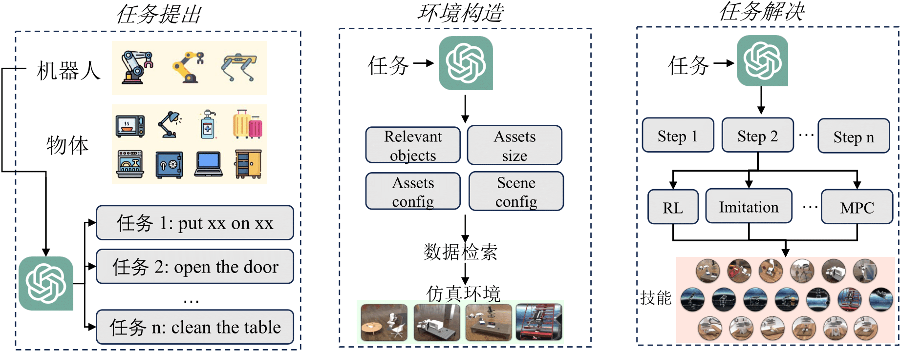

## 大模型驱动的具身智能：发展与挑战

白辰甲，许华哲，李学龙*. 大模型驱动的具身智能：发展与挑战. *中国科学：信息科学*（在审）

##### 图1: 领域典型进展

 

##### 图2: 综述整体框架

 

##### 图3: 具身智能基本概念示意图

 

##### 图4: 常见的具身实体机器人

 

##### 图5: 机器人常见的传感器类型和仿真环境观测

 

##### 图6: 模仿学习和分布偏移示意图

 

##### 图7: 强化学习结构和基本算法分类

 

##### 图8: 视觉基础模型和视觉-语言模型框架的典型架构示意图

 

##### 图9: 预训练表征用于具身决策示意图

 

##### 图10: 典型的 Affordance 表示方式

 

##### 图11: 大模型规划方法基本结构

 

##### 图12: 大模型驱动的树搜索方法

 

##### 图13: LLM/VLM 驱动的基础策略基本结构

 

##### 图14: 扩散模型驱动的动作规划和策略学习

 

##### 图15: 基于大模型的奖励生成框架对比

 

##### 图16: 具身智能中世界模型的典型框架

 

##### 图17: RoboGen 仿真环境和数据生成框架

